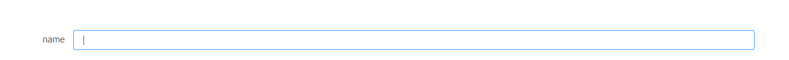

<!--
 * @Date: 2020-06-17 22:02:56
 * @LastEditors: 曾令宇
 * @LastEditTime: 2020-06-24 15:33:44
 * @FilePath: \element-ui-expansions\README.md
--> 
# element-ui-expansions
## 基于Element UI拓展组件库

1. ### Dynamic form item 动态表单项

   基本用法：

   ```vue
   <el-dynamic-form-item label="name" type="string" v-model="form.name" />
   ```

   

   #### 属性：

   | 参数            | 说明                                            | 类型                             | 可选值                                                      | 默认  |
   | --------------- | ----------------------------------------------- | -------------------------------- | ----------------------------------------------------------- | ----- |
   | value / v-model | 绑定值                                          | string / date / boolean / number |                                                             |       |
   | label           | 标签文本                                        | string                           |                                                             |       |
   | label-width     | 表单域标签的的宽度，例如 '50px'。支持 `auto`。  | string                           |                                                             |       |
   | size            | 用于控制该表单域下组件的尺寸                    | string                           | medium / small / mini                                       | small |
   | clearable       | 是否显示清除按钮                                | boolean                          |                                                             | true  |
   | type            | 显示类型                                        | string                           | string / number / textarea / date / boolean / select / file |       |
   | rows            | 输入框行数，只对 `type="textarea"` 有效         | number                           |                                                             | 6     |
   | readonly        | 原生属性，是否只读                              | boolean                          |                                                             | false |
   | options         | 选项列表，只对 `type="select"` 有效             | Array                            |                                                             |       |
   | option-prop     | 配置选项，具体看下表，只对 `type="select"` 有效 | object                           |                                                             |       |

   #### option-props：

   | 参数     | 说明                                 | 类型   | 可选值 | 默认     |
   | -------- | ------------------------------------ | ------ | ------ | -------- |
   | value    | 指定节点绑定值为节点对象的某个属性值 | string |        | value    |
   | label    | 指定节点标签为节点对象的某个属性值   | string |        | label    |
   | disabled | 指定节点禁用为节点对象的某个属性值   | string |        | disabled |

   #### Event：

   | 事件名称       | 说明                                         | 回调参数                                                 |
   | -------------- | -------------------------------------------- | -------------------------------------------------------- |
   | input          | 在 Input 值改变时触发，对 `type="file"` 无效 | (value: number &#124; string &#124; Date &#124; boolean) |
   | on-file-change | 在文件变更时触发，只对 `type="file"` 有效    | (file: File ,  fileList: FileList)                       |

   